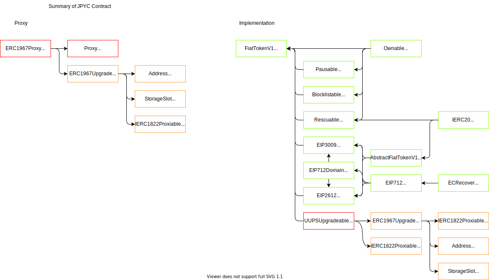
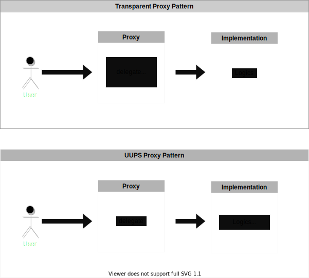

# JPYC protocol's Overview

## Motivation
We have a working protocol at the moment and to avoid confusion here we call it as the "previous JPYC". The "previous JPYC" is an ERC20 compatible token but it lacks some functionalities, e.g. upgradeability, etc for our current situation. We've made a decision to deploy JPYC protocol, with totally new smart contracts, for us to be ready to move on into the web3.0 world.    

Previous JPYC's information, white paper, and more can be found [here](https://jpyc.jp). 
## Brief introduction
JPYC protocol is an ERC20 compatible token. It allows minting of tokens by multiple entities, pausing all activity, freezing of individual addresses, rescuing of tokens and UUPS proxy pattern to upgrade the contract so that bugs can be fixed or features added. 

## Protocol's architecture


## About solidity's version
According to [Openzeppelin's recent update](https://github.com/OpenZeppelin/openzeppelin-contracts/commit/e192fac2769386b7d4b61a3541073ab47bb7723a) and [this contract's version](https://github.com/OpenZeppelin/openzeppelin-contracts/blob/e192fac2769386b7d4b61a3541073ab47bb7723a/contracts/proxy/ERC1967/ERC1967Upgrade.sol#L17). We need to keep the solidity verion equal to or higher than `pragma solidity 0.8.2`. We decided to use the comparatively new version of `0.8.11`.
## Proxy
### Comparison of upgradeable pattern
<table>
  <tr><th width="130">Upgrading Pattern</th><th width="450">Good</th><th width="450">Bad</th></tr>
  <tr><td>UUPS</td><td>・Good gas efficiency </br>・More flexibility about the upgradeability when upgrade function is located in implementation</br>・Upgrade function can be customized（access control, Ownable）<br>・Proxy with less comlexity <br>・Upgradeability can be removed </td><td>・Has the risk of losing upgradeability if the upgrade function is not included</br>・Some bugs reported on github in the past<br>・More complexity in implementation</td></tr>
   <tr><td>Transparent</td><td>・Longer history with many real examples</td><td>・Bad gas efficency<br>・More comlexity in proxy</td></tr>
</table>

- https://docs.openzeppelin.com/contracts/4.x/api/proxy#transparent-vs-uups
- https://docs.openzeppelin.com/upgrades-plugins/1.x/proxies

<br>



### Transparent Proxy Pattern

Transparent proxy pattern is one of the most used upgradeable patterns in the industry and even OpenZeppelin's plugin uses it as a default way to deploy upgradeable contracts. But it has some disadvantages. That's why openzeppelin team's recommendation is shifting towards UUPS proxy pattern.   

Transparent proxy pattern puts `upgradeTo(impl)` in the proxy contract. It could mean this pattern is vulnerable to "clash of fucntions" in proxy and implementation. In order to avoid it, in Transparent proxy pattern, not only `ifAdmin` modifier was implemented in the proxy contract but also admin address needs to be stored in proxy. As a result, gas efficiency becomes worse and comlexity increases. 

### UUPS(EIP1822) Proxy Pattern
https://eips.ethereum.org/EIPS/eip-1822   
[UUPS proxy pattern is recommended by the OpenZeppelin team](https://docs.openzeppelin.com/contracts/4.x/api/proxy#transparent-vs-uups). It is said that UUPS pattern is more lightweight and vasatile.    


- Proxies    
UUPS proxies are implemented using an `ERC1967Proxy`. The proxy is not upgradeable by itself. It delegates calls to implementation contract.
- Implementation    
UUPS's implementation includes the `upgradeTo` function by inheritting `UUPSUpgradeable`   contract. Then we can upgrade the implementation contract by calling the `upgradeTo` function.

### Diamond(EIP2535)
EIP2535, which is called "Diamonds" by the author, is a standard for creating modular smart contract systems that can be extended after deployment. Itself is quite powerful and vasatile but considering that it is not enoughly battle-tested we discarded this pattern.

### We went with UUPS proxy pattern
In light of the current condition, we were hesitating between UUPS parxy and Transparent proxy patterns. In the end, With the reasons below, we've chosen UUPS pattern.
- More simplicity in Proxy
- Less gas fee for user
- Higher flexibility for upgradeability
- Recommended by openzeppelin team
### Explanation of UUPS contract
https://github.com/OpenZeppelin/openzeppelin-contracts/tree/master/contracts/proxy

We adopted openzeppelin's library to implement the UUPS upgradeable pattern. The only thing we have changed is we added `uint256[50] private _gap;` as the last part of serveral contracts in order to prepare for future upgradings(e.g. adding state variables) and be aligned with Openzeppelin's code.

#### Proxy.sol
- This contract provides a `_fallback` function that delegates all calls from proxy contract to implementation contract using `_delegate` function. The virtual `_implementation` function needs to be overrode. 
#### UUPSUpgradeable.sol
This is an upgradeability mechanism designed for UUPS proxies. The contract is inherited by the implemetation contract(`FiatTokenV1`). By inheriting this contract, implementation contract acquires upgradeability. 

We want to note that the `_authorizeUpgrade` function must be overrode by the implementation contract. we have done that and set the access right `onlyOwner`.

`draft-IERC1822.sol` is from a recent [Openzeppelin's update](https://github.com/OpenZeppelin/openzeppelin-contracts/commit/e192fac2769386b7d4b61a3541073ab47bb7723a). We have adopted the update. 


#### ERC1967Upgrade.sol
The contract is from [EIP1967](https://eips.ethereum.org/EIPS/eip-1967). It standardise where proxies store the address of the logic contract they delegate to, as well as other proxy-specific information.

#### ERC1967Proxy.sol
This is the Proxy contract. It is from OpenZeppelin's library. It needs implementation contract's address `_logic` and `_data` to be initialized.

- A proxy contract.
- constructor
  - It checks if `_IMPLEMENTATION_SLOT` is right.
  - Initializes the upgradeable proxy with an initial implementation specified by `_logic`.
  - `_data` is an encoded function call, and the function call initializes the storage of the proxy like a `constructor`.
- _implementation
  - It override the function in `Proxy.sol` and is called by function of `Proxy.sol`.
## implementation
### explanation of implementation contract
- We created implementation with reference to [the centre-tokens](https://github.com/centrehq/centre-tokens/tree/master/contracts ), Which is a contract with various functions added to the ERC20 standard. 
- Also, each contract declares an empty state variable `gap`, so that state variables can be added later.

Hereby, I will explain every single added function for each contract. 
#### Ownable.sol
A contract that manages the access rights of the contract.
It is the same as openzeppelin library except for not adding the function `renounceOwnership` used for removing ownership.

#### Pausable.sol
A contract that manages the access rights of the pausability. 
If the pauser pause FiatTokenV1 contract, some functions is restricted.
#### Blocklistable.sol
A contract that manages the access rights of the blocklistability. 
If you are registered in the blocklist, you will not be able to use some functions. 
`FiatTokenV1` contract is blocklisted in the init funciton.
#### Rescuable.sol
A contract that manages the access rights of rescuing tokens. 
Only the rescuer is able to send ERC20 tokens that were mistakenly sent to the proxy contract's address. 
The contract uses the `safeTransfer` function.
#### EIP712Domain.sol
https://github.com/ethereum/EIPs/blob/master/EIPS/eip-712.md  
The contract stores EIP712 Domain Separator. If the chain ID is different, it will be recalculated.
EIP3009 and EIP2612 require EIP712 Domain.
#### EIP3009.sol
https://eips.ethereum.org/EIPS/eip-3009  
A contract that enables transferring of fungible assets via a signed authorization. 
The contract uses v, r and s to recover the address and verify if it matches the owner.

- `authorizationState`
  - There is a nonce for each user, and the same nonce cannot be used again.
  - The nonce is randomly determined.
- `_transferWithAuthorization`
- `_receiveWithAuthorization`
  - The destination of transferFrom is msg.sender.
- `_cancelAuthorization`
  - It deauthorize the nonce. You can undo a metatransaction that you signed incorrectly.
- `_requireUnusedAuthorization`
  - It checks if the nonce is already used. 
- `_requireValidAuthorization`
  - It checks if block.time is valid.
- `_markAuthorizationAsUsed`
  - It makes the nonce used and emits an event.
#### EIP2612.sol
https://eips.ethereum.org/EIPS/eip-2612  
A contract that enables transferring of fungible assets via a signed authorization. 
The contract uses v, r and s to recover the address and verify that it matches the authorizer.
- nonces
  - There is a `nonce` for each user, and the same `nonce` cannot be used twice.
  - The `nonce` increases one by one.
- _permit
  - It checks if `block.time` is valid.
  - If the recoverd address matches The owner, `_approve` is called.

#### FiatTokenV1
- Manages the access rights of the minterAdmin.
- Has an initializing function
  - `blocklisted[address(this)] = true`
  - `makeDomainSeparator(name, "1")`
  - `initialized = true`
  - mint, burn, increaseAllowance, decreaseAllowance
- Override the `_authorizeUpgrade` function with `onlyOwner` modifier.

#### FiatTokenV2
- It is an assumed upgraded version of FiatTokenV1 with a new functionality `allowlist`.
- It allows only users who are allowlisted to send or approve over 100,000 token to other user.
- Other than that everything is the same as FiatTokenV1.

### Note
- We used `ERC1967Upgradeable.sol`’s code, but it is used partially because we selected UUPS upgradeable pattern. Functions like Beacon or Transparent pattern’s parts are not used in the current situation. We removed the unused parts.


## How to start

Install nodejs, refer to [nodejs](https://nodejs.org/en/)

```
git clone https://github.com/code-423n4/2022-02-jpyc.git

cd 2022-02-jpyc

npm i

// test
npx hardhat test
// When specifying the path
npx hardhat test test/direcotry/file

// coverage
npx hardhat coverage
// When specifying the path
npx hardhat coverage test/direcotry/file

// contract-sizer
npx hardhat size-contracts
```
## Used tools
- hardhat
  - https://hardhat.org/getting-started/
- solidity-coverage
  - https://www.npmjs.com/package/solidity-coverage
- contract-sizer
  - https://www.npmjs.com/package/hardhat-contract-sizer

## test reference
- Openzepplin test
  - https://github.com/OpenZeppelin/openzeppelin-contracts/tree/master/test
- Centre-tokens test
  - https://github.com/centrehq/centre-tokens/tree/master/test

### unit test
- test/util/ECRecover.test.js

### integration test
- test/v1/FiatTokenV1.test.js
  - test/v1/Initialize.behavior.js
  - test/v1/ERC20.behavior.js
  - test/v1/Blocklistable.behavior.js
  - test/v1/Ownable.behavior.js
  - test/v1/Pausable.behavior.js
  - test/v1/Rescuable.behavior.js
  - test/v1/EIP3009.behavior.js
  - test/v1/EIP2612.behavior.js
  - test/v1/FiatTokenV1.behavior.js
  - test/v1/UUPSUpgradeable.behavior.js

### functional test
Test with proxy
- test/v1_proxy/FiatTokenV1_proxy.test.js
  - test/v1/Initialize.behavior.js
  - test/v1/ERC20.behavior.js
  - test/v1/Blocklistable.behavior.js
  - test/v1/Ownable.behavior.js
  - test/v1/Pausable.behavior.js
  - test/v1/Rescuable.behavior.js
  - test/v1/EIP3009.behavior.js
  - test/v1/EIP2612.behavior.js
  - test/v1/FiatTokenV1.behavior.js
- test/storageSlot/storageSlot.test.js
  - test/storageSlot/storageSlot.behavior.js
- test/upgradeability/UUPSUpgradeable.test.js

## USDCcontracts
- USDCimple.sol
- USDCmin.sol
- USDCpro.sol
- USDCupgrader.sol

## Other README.md files
If you want more information about how the contracts are forked or test files, see files below. 
- contracts/README.md
  - contract list
- test/READEME.md
  - test list

## References
[Openzeppelin's recent update](https://github.com/OpenZeppelin/openzeppelin-contracts/commit/e192fac2769386b7d4b61a3541073ab47bb7723a)   
[EIP1967](https://eips.ethereum.org/EIPS/eip-1967)   
[Transparent-vs-uups by Openzeppelin](https://docs.openzeppelin.com/contracts/4.x/api/proxy#transparent-vs-uups)    
[the centre-tokens](https://github.com/centrehq/centre-tokens/tree/master/contracts )   
[UUPS proxy pattern explanation](https://www.youtube.com/watch?v=kWUDTZhxKZI)   
[EIP2535](https://eip2535diamonds.substack.com/p/introduction-to-the-diamond-standard)   
[Unstructured storage pattern](https://blog.openzeppelin.com/upgradeability-using-unstructured-storage/)

## 📝 License

Copyright © 2022 [JPYC](https://jpyc.jp). <br />
This project is [MIT](https://github.com/jcam1/JPYCv2/blob/master/LICENSE) licensed.